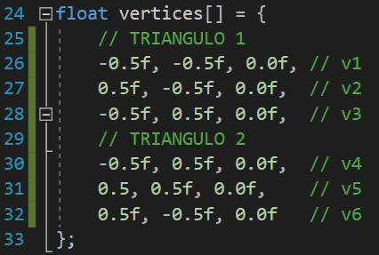
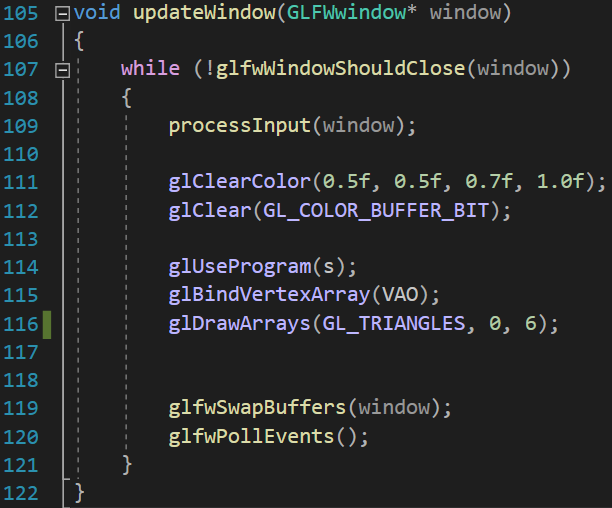
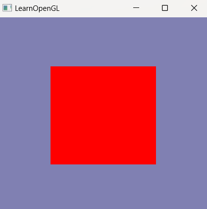

<h1>
Programación de Videojuegos
</h1>

  <ul style="list-style-type: none;">
    <li><i>Universidad Autónoma de San Luis Potosí</i></li>
    <li><i>Facultad de Ingeniería</i></li>
    <li><i>Parcial 1</i></li>
    <li><i>Angel de Jesús Maldonado Juárez</i></li>
    <li><i>Actividad 1</i></li>
    <li><b>07 de febrero del 2023</b></li>
  </ul>
  

## Rectángulo formado por 2 triángulos
La figura geométrica que requiere menos procesamiento y que,
por lo tanto, le resulta más sencillo, rápido, y eficiente
representar a la computadora es el triángulo. En el siguiente
fragmento de código se representan una serie de puntos para
lograr mostrar en pantalla 2 triángulos juntos, de manera que
pueda visualizarse finalmente un recuadro:

Los pares de vértices **v1**, **v6**, **v3**, y **v4** ocupan
la misma posición en el plano, ya que el framework *OpenGL*
requiere la ubicación explícita de los puntos para poder
dibujar los triángulos en pantalla con la función 
`glDrawArrays()`:

Como tercer parámetro de esta función, se le especifican la 
cantidad de vértices que tiene el arreglo `vertices[]`, este
arreglo se encuentra guardado en el objeto llamado
**Vertex Array Buffer** (*VAO*).

Finalmente, después del procesamiento de *Shaders* y
generación de ventana que conlleva utilizar el framework,
el resultado es el siguiente:

