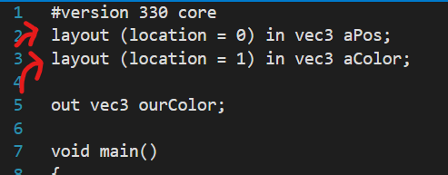
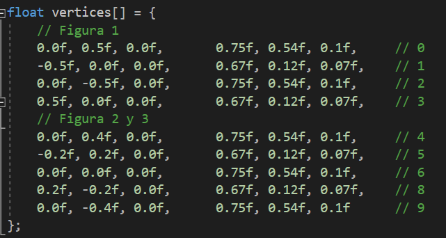
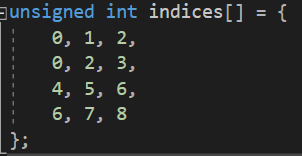
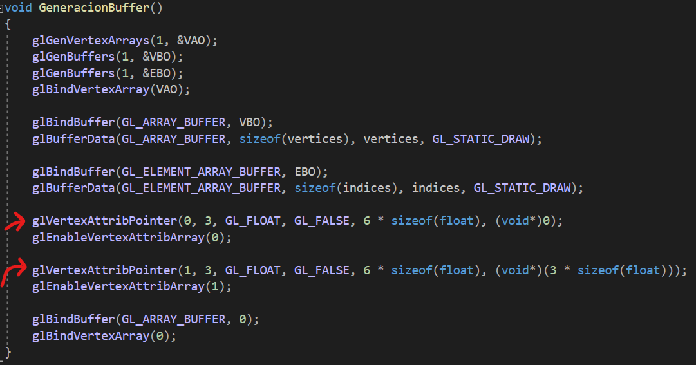
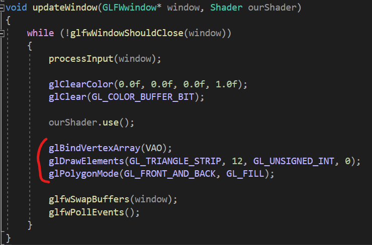
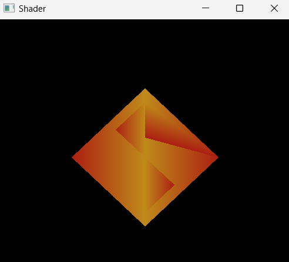

<h1>
Programación de Videojuegos
</h1>

  <ul style="list-style-type: none;">
    <li><i>Universidad Autónoma de San Luis Potosí</i></li>
    <li><i>Facultad de Ingeniería</i></li>
    <li><i>Parcial 1</i></li>
    <li><i>Angel de Jesús Maldonado Juárez</i></li>
    <li><i>Actividad 1</i></li>
    <li><b>13 de febrero del 2023</b></li>
  </ul>
  

## Elementos del buffer con OpenGL
En programación gráfica se le puede indicar a la tarjeta la
distribución (*layout*) del buffer, es decir, qué datos y cómo
están distribuidos en el arreglo de locaciones. Esta
distribución puede ser personalizada o ajustada de acuerdo a
las necesidades del programa.

La actividad consiste en representar la siguiente figura,
creando la distribución del buffer:

Utilizando la plantilla de la clase con los <i>shaders</i>
listos para recibir el color mediante los elementos del
buffer:

El buffer (arreglo) en el cual se define la distribución de
los datos <i>vértice</i> y color es el siguiente:

Posteriormente, se define un arreglo en donde se especifica el
orden en el cual se <i>pintan</i> los vértices:

Posteriormente, en la función `GeneracionBuffer()` se crean
los buffers `VAO` (Vertex Array Buffer), `EBO` (Element
Buffer Object), `VBO` (Vertex Buffer Object), en donde
el primero crea la inicialización para distribuir el buffer
(Array), el segundo es para indicar los índices del objeto en
pantalla, y el último declara la información de los vértices
como tal (vértice - color en este caso).

Finalmente, en la función de `updateWindow()` se carga el 
`VAO` y se utiliza la función `glDrawElements()`, y se indica
en el parámetro `count` la cantidad de indices que contiene el
arreglo `indices`:

Al ejecutar el programa se obtiene el siguiente resultado:

