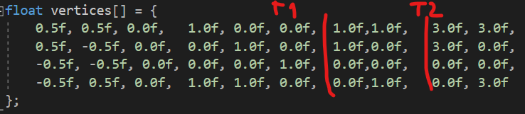
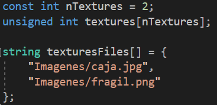
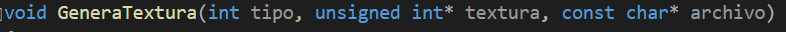
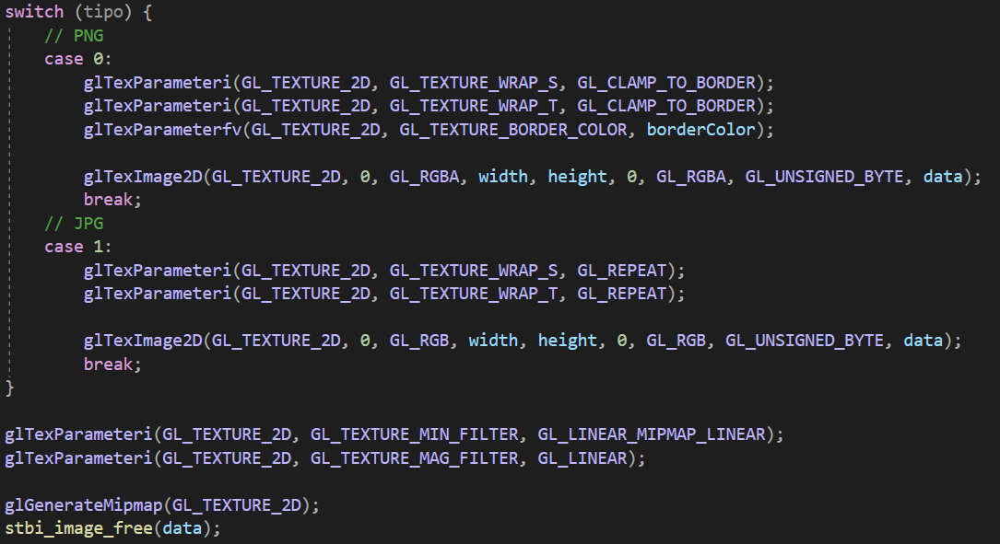
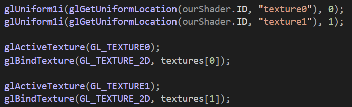
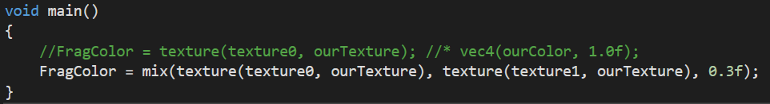
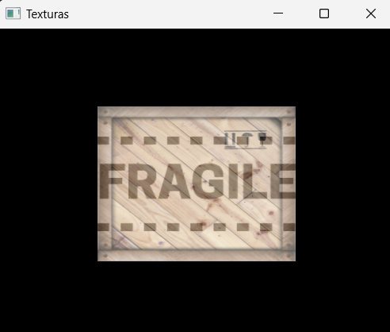

<h1>
Programación de Videojuegos
</h1>

  <ul style="list-style-type: none;">
    <li><i>Universidad Autónoma de San Luis Potosí</i></li>
    <li><i>Facultad de Ingeniería</i></li>
    <li><i>Parcial 1</i></li>
    <li><i>Angel de Jesús Maldonado Juárez</i></li>
    <li><i>Actividad 1</i></li>
    <li><b>17 de febrero del 2023</b></li>
  </ul>
  

## Generación de texturas
La generación de texturas en la programación
gráfica conlleva establecer las coordenadas en
las cuales se agregarán los gráficos o información
de una imagen, en esta actividad se le agrega al
`VBO` (Vertex Buffer Object), pares de coordenadas
a cada punto, las cuales representan las
posiciones a partir de las cuales se van a mostrar
las texturas:

Posteriormente, para almacenar la información de las texturas,
como el id de la textura, ruta del archivo de imagen, y la
cantidad de texturas se crearon las siguientes variables:

Para generalizar la generación de los buffers de las texturas
se agregaron los siguientes parámetros a la función
`GeneraTextura()`:

- `tipo`: indica si el archivo de imagen es *.png* o *.jpg* (0 o 1 respectivamente).
- `textura`: es la variable que guarda el id de la textura.
- `archivo`: es la ruta del archivo de imagen de la textura.

Una vez que el archivo de imagen fue cargado correctamente
con la función `stbi_load()`, se definen distintos parámetros
para las texturas con base en el tipo de imagen que se cargó
(0 para png y 1 para jpg).

Posteriormente, una vez que hayan sido cargadas las texturas
al buffer, en la función `updateWindow()` se actualizan las
variables uniformes `texture0` y `texture1` para que el
*fragmentShader* pueda distinguir ambas texturas (con las
locaciones 0 y 1 en el buffer), después se activan y se
enlazan ambas texturas con `active()` y `bind()`:

Finalmente, el *fragmentShader* utiliza la función `mix()`
para combinar ambas texturas y lograr que la transparencia
del archivo png pueda permitir que la imagen de abajo se logre
distinguir:

Al ejecutar el código se obtiene el siguiente resultado:

