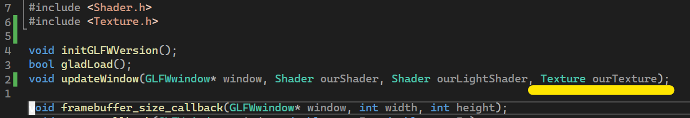
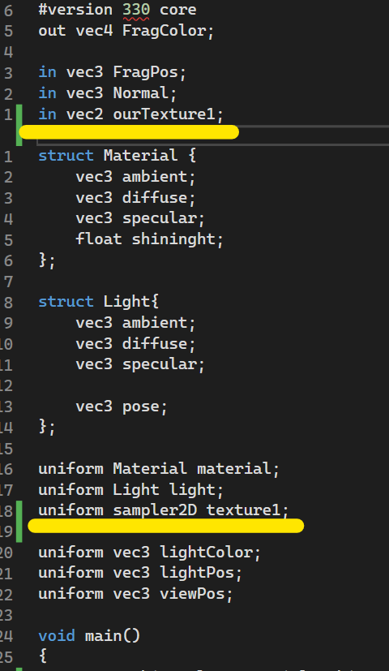

<h1>
Programación de Videojuegos
</h1>

  <ul style="list-style-type: none;">
    <li><i>Universidad Autónoma de San Luis Potosí</i></li>
    <li><i>Facultad de Ingeniería</i></li>
    <li><i>Parcial 2</i></li>
    <li><i>Angel de Jesús Maldonado Juárez</i></li>
    <li><i>Actividad 1</i></li>
    <li><b>14 de marzo del 2023</b></li>
  </ul>
  

##  Incorporación de texturas al proyecto de iluminación 
Como primer paso simplemente se agregó la directiva 
`#include` con la librería `Texture.h` en el archivo 
`main.cpp`, la cual tiene la clase `Texture` para poder
importar, cargar, y manejar texturas:

En la función `main()` de este mismo archivo, se agregó la
variable `ourTexture`, la cual se utiliza para cargar y
guardar la textura en tiempo de ejecución:

En este mismo archivo, en la función `updateWindow()` se le
agregó como parámetro un objeto `Texture` llamado
`ourTexture`, el cual se utiliza para renderizar en tiempo
de ejecución la(s) textura(s) que vayan a cargarse utilizando
el método `ViewTexture()` del objeto del parámetro:

En el archivo `Cube.h`, se le agregó al arreglo `vertices`,
las coordenadas de la textura después de las normales:

Nuevamente en el archivo `main.cpp` se modificaron las
funciones `GeneracionBufferCube()` y `GeneracionBufferLight()`
, agregando la nueva distribución del arreglo `vertices`:

En el archivo `vertexShader.vs` se agregó el nuevo `layout`
con las coordenadas de la textura llamado `aTexture1`, esta
misma variable se declara como salida `ourTexture1` para que
el *Fragment Shader* lo pueda recibir, finalmente, en el
`main()` se iguala `ourTexture1` con el valor de `aTexture1`:

En el archivo `fragmenShader.fs` se declara la variable de
entrada `ourTexture1`, que representa las coordenadas de la
textura, y la variable uniforme `texture1`, que será la
imagen de la textura como tal. En el `main()` como prueba,
simplemente se deja comentada la línea en donde se manda la
salida `FragColor` con el resultado de las operaciones con
la luz, y se iguala a la creación de una única textura:

Finalmente, en el directorio del proyecto se agregó otro directorio llamado `Imagenes` el cual contendrá todos los archivos de imagen relacionados con las texturas de los objetos:

Al ejecutar el proyecto se puede observar el cubo cargado
con la textura `caja.jpg` de manera exitosa junto con la luz:

