<h1>
Programación de Videojuegos
</h1>

  <ul style="list-style-type: none;">
    <li><i>Universidad Autónoma de San Luis Potosí</i></li>
    <li><i>Facultad de Ingeniería</i></li>
    <li><i>Parcial 2</i></li>
    <li><i>Angel de Jesús Maldonado Juárez</i></li>
    <li><i>Actividad 2</i></li>
    <li><b>30 de marzo del 2023</b></li>
  </ul>
  

## Primer avance del proyecto
El proyecto consta de la creación de un videojuego con vista
de primera persona, en donde el jugador deberá superar un mapa
de obstáculos. Este mapa deberá basarse en el inflable
mostrado en el video [*Ultimate Survival - 395ft / 120m
Inflatable Obstacle Course*](https://www.youtube.com/watch?v=gxt3T2VlWhQ):

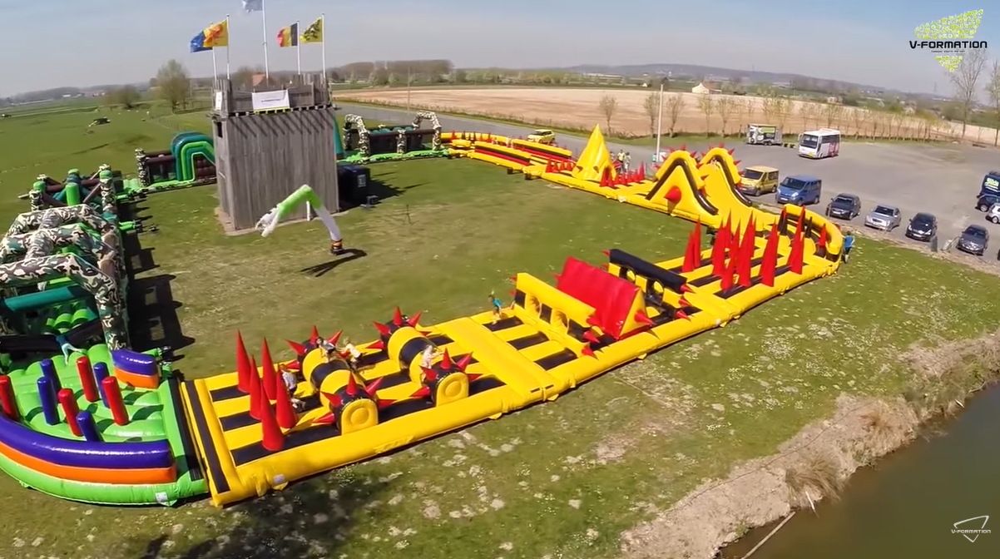

## Modelado del mapa
Para el modelado del mapa y los obstáculos se utiliza el
programa [*Blender*](https://www.blender.org/), el avance del
mapa sin texturas ni materiales es de la siguiente forma:

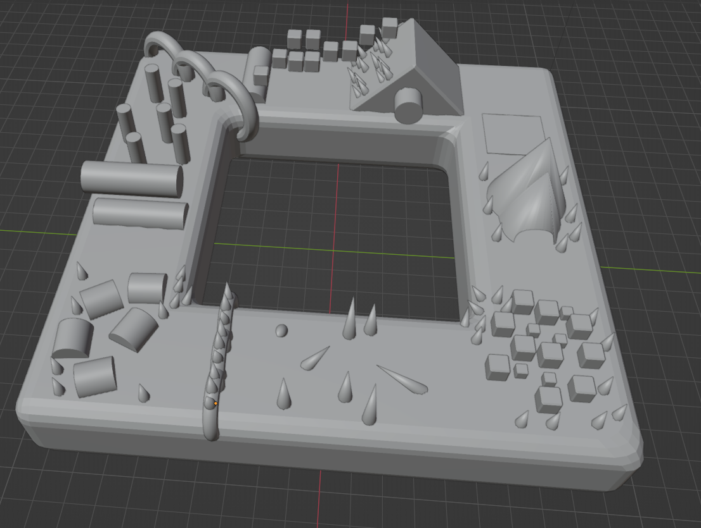

Para la base del mapa se utiliza una imagen que simula
la textura y apariencia de la lona del inflable:

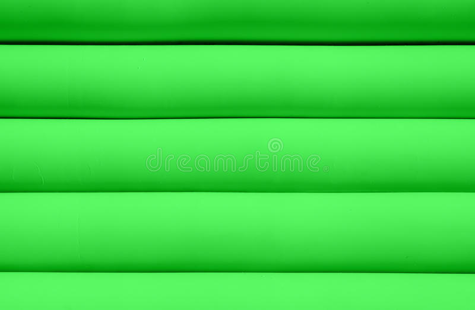

Para la placa de meta también se utiliza una imagen con el
patrón de cuadros blanco y negro:

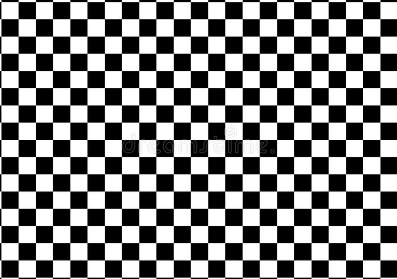

Los picos y obstáculos del mapa no utilizan ninguna textura,
sin embargo, se crea un material utilizando un nodo **BSDF**
(*Bidirectional Scattering Distribution Function*), cuya
configuración queda de la siguiente forma:

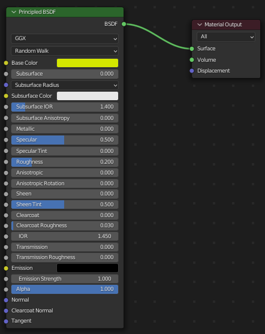

Cada obstáculo será de un color distinto, por lo que
simplemente se optó por duplicar el primer material creado
la misma cantidad de colores que habrá en el mapa:

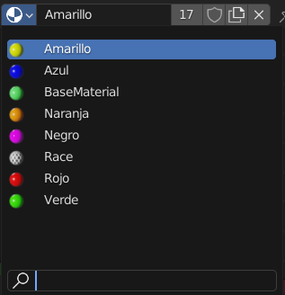

Finalmente, al aplicar las texturas y materiales a cada
elemento en el mapa, este se visualiza de la siguiente
manera:

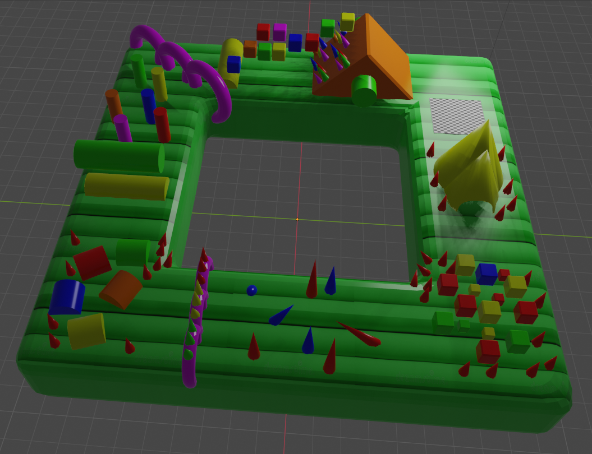

Para la exportación del modelo se optó por el formato *.obj*,
por lo que se generará el archivo del modelo *.obj* junto con
el archivo que contiene los materiales *.mtl* la configuración
de exportado queda de la siguiente manera:

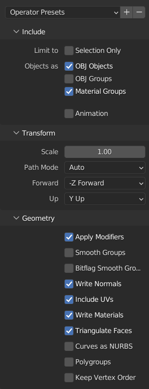

## Lectura del modelo y los materiales en OpenGL

Como segundo avance del proyecto se carga el modelo del mapa
del juego utilizando *OpenGL*, la plantilla del proyecto en
*Visual Studio*, y el código visto en clases.

Para la carga del modelo simplemente se reemplaza la cadena
de la ruta de uno de los modelos que se cargan en el archivo
`main.cpp`:

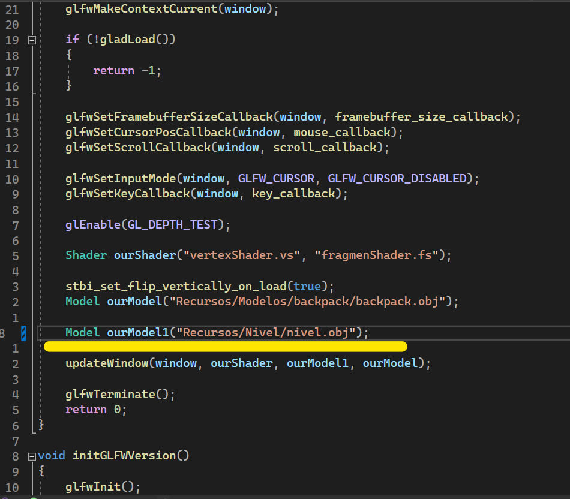

A manera de prueba, simplemente se modifica el valor de la
variable `UseTexture` en el archivo `vertexShader.vs` entre 0
y 1 para visualizar el mapa sin texturas y con color o con
texturas y sin color (respectivamente):

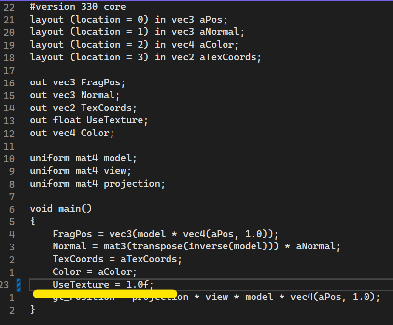

## Mapa sin texturas y con color (en OpenGL)

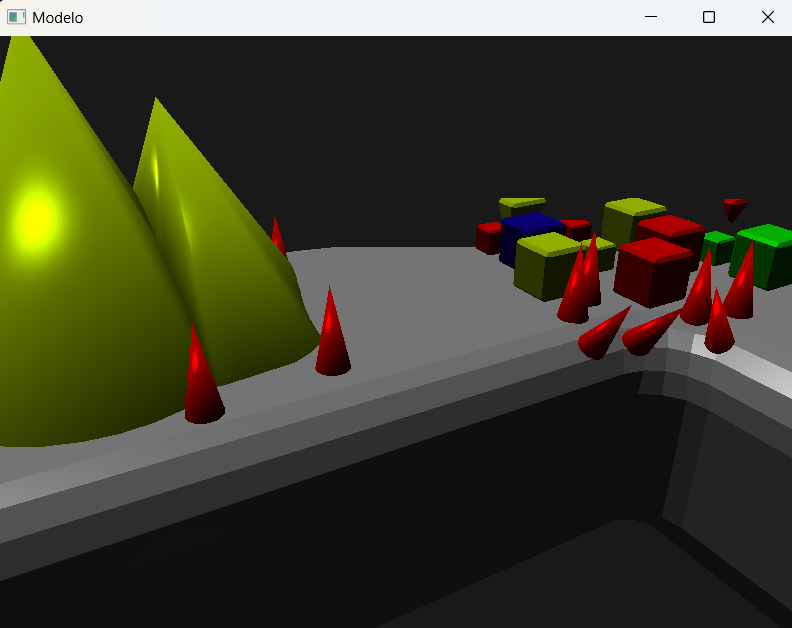

*El mapa queda corto para el área de visualización
(renderizado), por lo que el mapa debe escalarse a un
tamaño más chico, o debe agrandarse el área de renderizado.*

## Mapa con texturas y sin color (en OpenGL)

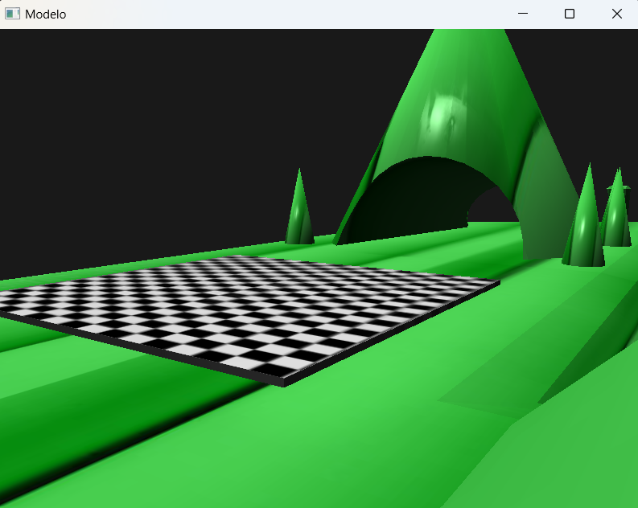

