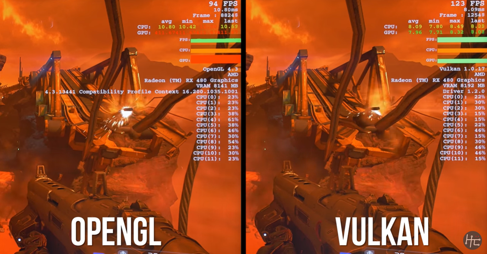
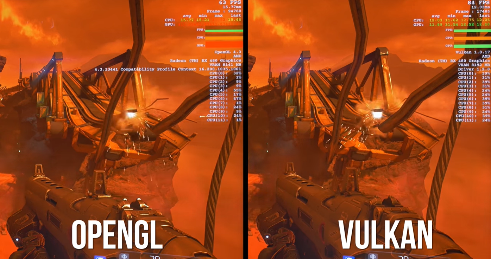
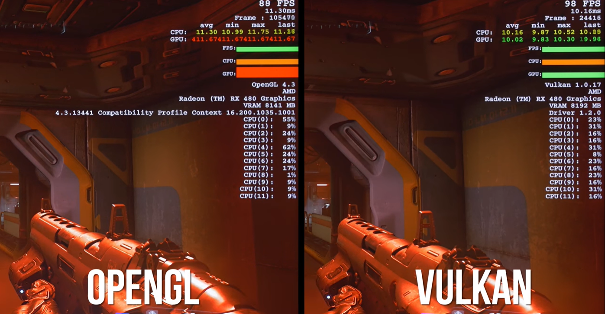
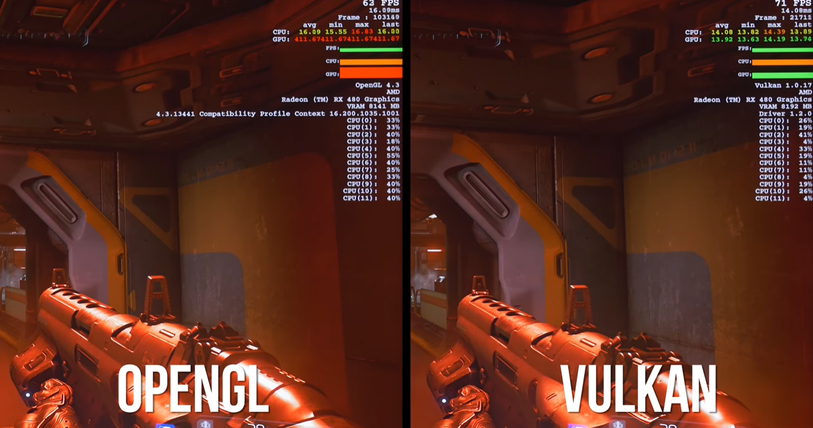

<h1>
Programación de Videojuegos
</h1>

  
    <ul style="list-style-type: none;">
      <li><i>Universidad Autónoma de San Luis Potosí</i></li>
      <li><i>Facultad de Ingeniería</i></li>
      <li><i>Parcial 1</i></li>
      <li><i>Angel de Jesús Maldonado Juárez</i></li>
      <li><i>Tarea 1: OpenGL vs Vulkan</i></li>
      <li><i>Fecha de entrega: <b>30 de enero del 2023</b></i></li>
    </ul>
    
  

## OpenGL
*Silicon Graphics* inició el desarrollo de *OpenGL* en 1991 y fue lanzado en 1992 como una herramienta de programación, *API* (*Application Programming Interface*), para facilitar el desarrollo de programas que requieran manejo de gráficos, como simuladores, visualización de datos, videojuegos, etc.

En un inicio *OpenGL* recibió un enfoque de programación funcional y estaba pensado para funcionar en procesadores de un solo núcleo, y con forme el hardware fue evolucionando, las tarjetas gráficas permitían más funcionalidades y mayor rapidez de procesamiento, por lo que *OpenGL* requería mayor mantenimiento y actualizaciones.

Desde el año 2006, el desarrollo y continuación de *OpenGL* quedó bajo la responsabilidad de *Khronos Group*, quienes anunciaron que OpenGL ya no recibirá actualizaciones en 2017, y en cambio lanzaron al mercado **Vulkan**.

## Vulkan
La nueva *API* de *Khronos Group* fue lanzada en 2016 como una alternativa de *OpenGL* orientada al procesamiento y manejo de gráficos utilizando el hardware más moderno del mercado, el cual permite el procesamiento multi-núcleo y nuevas funcionalidades como el *Ray Tracing*. Además, *Vulkan* desde el inicio se creó utilizando un enfoque de *Programación Orientada a Objetos*, ofrece un mayor control sobre el hardware en bajo nivel, tiene un soporte en la mayoría de plataformas (entre ellas *Windows*, *Linux*, *Android*, y *MacOS* con software de terceros).

## Doom con *AMD-RX480* Vulkan vs OpenGL
A continuación se muestran los resultados de un gameplay de Doom en PC utilizando la tarjeta gráfica de AMD *RX480*, en la misma escena, con distintas configuraciones, y utilizando *Vulkan 1.0.17* y *OpenGL 4.3* como *APIs* de renderizado.

### Primer escena baja resolución
Se consigue una diferencia de 30FPS (aproximadamente).

### Primer escena alta resolución
Se consigue una diferencia de 20FPS (aproximadamente).

### Segunda escena baja resolución
Se consigue una diferencia de 10FPS (aproximadamente).

### Segunda escena alta resolución
Se consigue una diferencia de solamente 8FPS (aproximadamente).

## Conclusiones
Sin lugar a dudas, *Vulkan* es una *API* que ofrece un mejor desempeño en el manejo y renderizado de gráficos por computadora, sin embargo, debido a que tiene un enfoque *Orientado a Objetos* la curva de aprendizaje para programadores primerizos es bastante amplia. Por lo que *OpenGL* es una muy buena alternativa para adentrarse al mundo de la graficación por computadora, ya que su enfoque puede ser funcional u Orientado a Objetos. Sin embargo, la constante y rápida evolución de la tecnología y hardware obliga tanto a *Vulkan* como a los programadores mejorar y adaptarse a los nuevos y últimos componentes del mercado.

## Referencias
- Hardware Canucks. (2016). Vulkan vs OpenGL in DOOM feat. RX480 [YouTube Video]. Retrieved from https://www.youtube.com/watch?v=ZpAC6tMa9Es&t=129s
  
- Wikipedia Contributors. (2023, January 19). OpenGL. Retrieved January 28, 2023, from Wikipedia website: https://en.wikipedia.org/wiki/OpenGL
  
- de, C. (2016, March 13). Vulkan. Retrieved January 28, 2023, from Wikipedia.org website: https://es.wikipedia.org/wiki/Vulkan?classId=274fba58-b5d9-46ef-8b55-b4a82ee41a97&assignmentId=4d4ffc4d-89c2-4f34-935f-ff3b4de003b6&submissionId=50b34fcb-111a-1335-0c1a-44674b5d8d63
‌‌